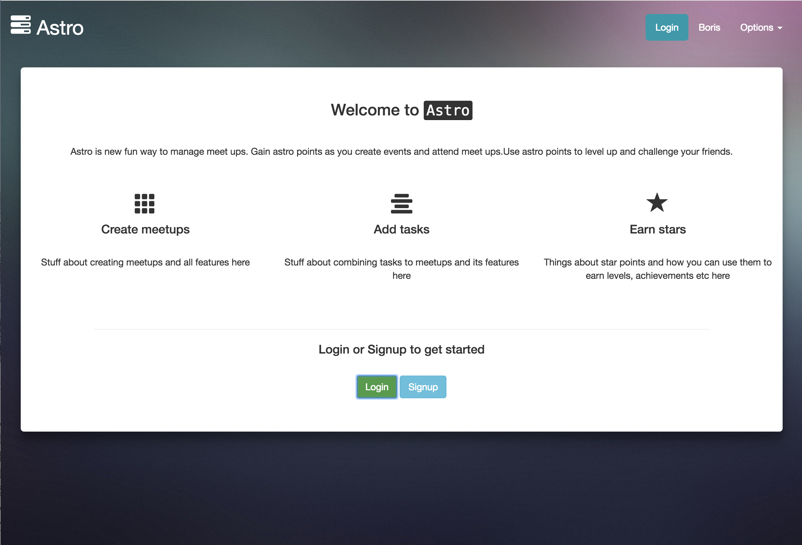
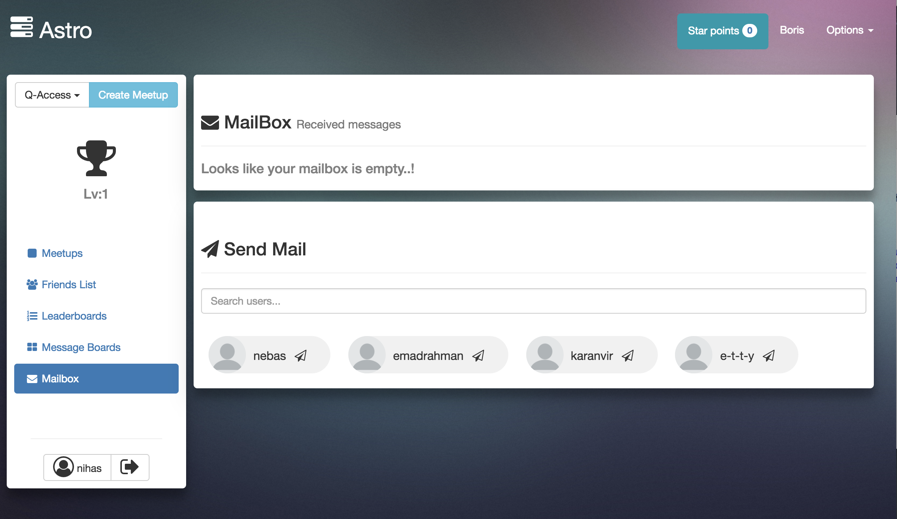

# Astro

Astro is a twist on a meetup app that motivates you into planning meetups/events with incentives earning achievements while competing with others, ranking up... (to name a few) 


## Important: How to Run:
1. ```vagrant up```
2. ```vagrant ssh```
3. ```cd astro```
4. ```sudo meteor --allow-superuser``` (x2) - There is an issue with vagrant and meteor so you must run this command 2 times. It will fail the first time but succeed the second time
5. Go to localhost:8080


### Notes
> - hosted on nginx
> - store only has avatars and boosters for sale. More items will come in the future


### Checkpoint 1


> The group implemented most core features for the app:
>   - Handling secure authenticaion
>   - Meetups
>   - Discussion Boards
>   - Leaderboards
>   - Social Features (Friends)
>   - MailBox System


`Attached below are screenshots that show the home page and the users page`




